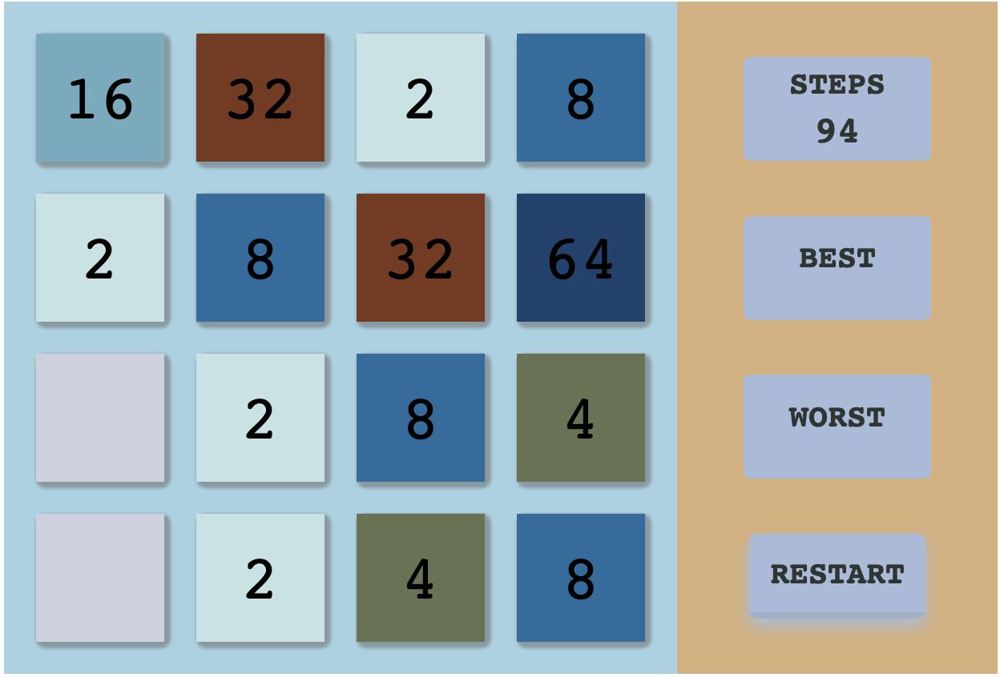

# 2048

 

**2048 is a single-player sliding tile puzzle video game written by Italian web developer Gabriele Cirulli and published on GitHub**

- [More About 2048](<https://en.wikipedia.org/wiki/2048_(video_game)>)
- [Click Here](https://mmbliv.github.io/2048/) to play
- [Source Code](https://github.com/mmbliv/2048)

## How to play

1. Open the game on your web browser.
2. The goal is to combine number tiles to make a tile with the value of 2048.
3. Use the arrow keys on your keyboard (up, down, left, right) to move the tiles in that direction.
4. When two tiles with the same number touch, they merge into one tile with double the value.
5. Keep combining tiles until you reach the 2048 tile or the board is completely filled with tiles.
6. If you reach the 2048 tile, congratulations! If not, you can try again.

## Technologies

- Javascript
- HTML
- CSS
